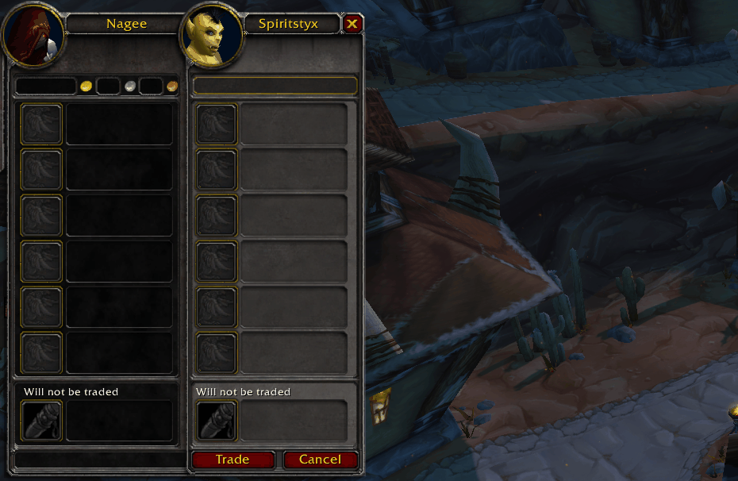

# EnchantClickables

Framework for showing (clickable) enchants based upon what is in the Do Not Trade window

It should also be available on:
 - wago.io addons: https://addons.wago.io/addons/enchantclickables
 - curse: https://www.curseforge.com/wow/addons/enchant-clickables (pending code review atm)
 - wowinterface: https://www.wowinterface.com/downloads/fileinfo.php?id=26881

buymeacoff.ee/caffeineaddict

Port of Enchant Clickables - https://wago.io/17ZQgjA3y

(Currently Supports Classic and TBC ... LK introduces API changes that I didnt port due to not having a working test platform atm ... ping me if someone has a need)